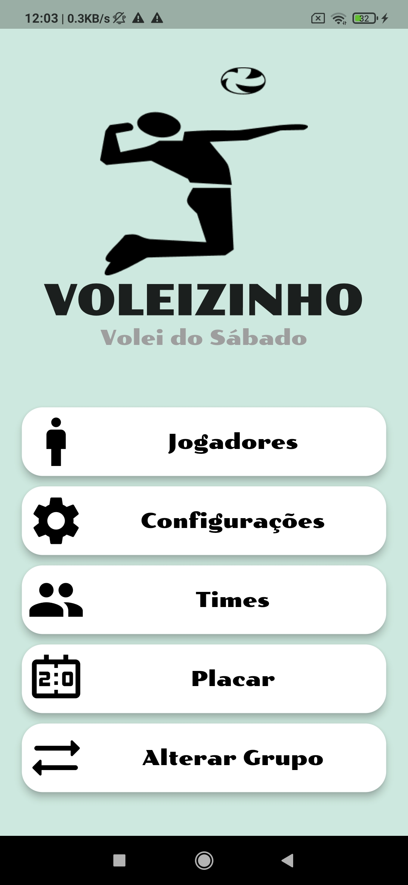

# Voleizinho

Voleizinho is a mobile application developed in Flutter for Android and IOS. This application aims to provide a tool for groups of friends who play volleyball, helping to balance teams based on the individual skills of each player in different volleyball fundamentals.

## Features

- **Group Creation**: Users can create different groups to manage players and matches separately.

- **Player Profile**: Each player added to a group will have a level in six volleyball fundamentals (Setting, Attack, Block, Reception, Movement, and Serve), mapped on a scale from 0 to 5 stars.

- **Fundamental Relevance**: Users can set a level of relevance for each of the fundamentals, allowing the calculation of the average level of each player's skills.

- **Team Selection**: Users can choose which players will participate in a match and define the number of players on each team.

- **Team Balancing**: The system automatically balances teams based on the weighted averages of each player's skills, creating teams as balanced as possible.

- **Team Sharing**: After team formation, users can share the team selections with the other players via WhatsApp.

## Screenshots

## Contribution

If you want to contribute to the development of this project, follow these steps:

1. Fork the repository.
2. Create a branch with your feature: `git checkout -b my-feature`.
3. Commit your changes: `git commit -m 'Add my feature'`.
4. Push to the branch: `git push origin my-feature`.
5. Open a pull request.

## License

This project is licensed under the MIT License

## Contact

- Author: Felipe Araújo
- Email: fbenaraujo@gmail.com

## Acknowledgments

We appreciate everyone who contributed to the development of this project.

---
